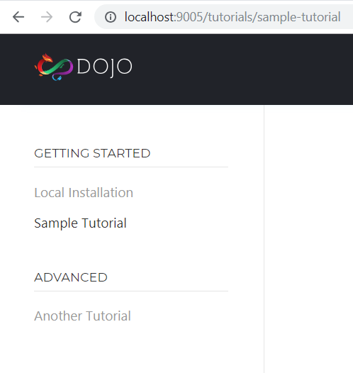

# dojo.io

Next generation dojo.io.

## Running dojo.io Locally

Build Time Rendering does not function properly with dojo's serve feature, so docker is used instead to serve up the static site (same as the Now deployments).

### Pre-requisites

The only pre-requisite is to have [Docker](https://store.docker.com/editions/community/docker-ce-desktop-mac) installed, running and logged in with a valid Docker account.

### Install, Build and Start Docker

1. Install, `npm install`
2. Build the site once, `npm run build:docker`
  - The docker build relies on the `dist` build of the site.
	- If you use VSCode you can set this command up as your default build task.
3. Start docker, `docker-compose up`
4. Go to http://localhost:9005/

### Start Docker

Run `docker-compose up -d`.

### View Docker Logs

Run `docker-compose logs -f`.

### Stop Docker

Run `docker-compose down`.

## Build Time Renderer (BTR)

[dojo.io](https://dojo.io) is built using the Build Time Renderer, part of the dojo build process, to statically render each route defined in the `.dojorc` file. During the build process, after the site is built, each route is loaded up in puppeteer, a snapshot is taken, and an index.html is generated. This allows pages to be loaded in full, quickly and without javascript enabled. Once the page is loaded, the loading of the rest of the app occurs. This loading is further improved with code splitting.

## Code Splitting

Each route defined in the `.dojorc` file for BTR should have its own unique `Outlet` in the `App.tsx` file and that `Outlet` should point to a unique widget for the route. If you are using the content pipeline to dynamically build your pages (aka you are using the `Section` or `Page` widgets) a wrapper widget may be required to accomplish this requirement (**example**: `TutorialsPage` and `TutorialsLanding`).

## Content Pipeline

In Dojo 5, a new feature was introduced to the Build Time Renderer called `Blocks`. `Blocks` allow us to run nodejs code during the BTR process, cache the results in the javascript output, and render them in the client. This forms the basis of the content pipeline.

In the content pipeline there are two Blocks at current (found under `src/scripts`):

- `SectionList`
- `Compile`

Both Blocks start by reading the `manifest.json` file under `content`.

### SectionList

SectionList reads the `manifest.json` file, pulls out a section and returns a list of pages (grouped by subsection). This is used for generating menus within a section (**example**: Tutorials).



### Compile

Compile tasks a path to a markdown file, relative to the `content` path, as an input. The markdown file is then run through `remark`, which converts it to HTML and looks for specially designated tags to convert to Dojo widgets. This is used for generating entire pages from markdown.

### Available Widgets

The available dojo widgets are defined in `src/scripts/compile.ts` file as `handlers`.

#### Alert

The `Alert` renders a section of text with a colored left border. It takes an optional `type` parameters.

**Types**
- info (`default`)
- success
- warning
- danger

**Default sample**
```
[Alert]
Create a new root node for the application
[/Alert]
```


**Warning sample**
```
[Alert type=warning]
Create a new root node for the application
[/Alert]
```


#### Aside

The `Aside` widget takes a title parameter, and renders a card with a title and body text. The widget has a black background with an orange left border.

**Sample**

```
[Aside title="Mandatory object for properties"]
The 2nd argument of the `w()` function is mandatory even you have no properties to pass in. This is to ensure the correct type guarding for all widgets in TypeScript.
[/Aside]
```


#### CodeBlock

The `CodeBlock` widget takes two requires parameters (`path` and `language`) and one optional parameter (`region`).

- **path** - The path, relative to the `content` folder, of a file to parse.
- **language** - The language to use for code highlighting.
- **region** - (`Optional`) A defined region within the file to grab. If not provide, the entire file's contents will be returned.

**CodeBlock from file sample**

```
[CodeBlock path=tutorial-2-finished/src/widgets/App.tsx, language=tsx]
```


**CodeBlock from file with region**

```
[CodeBlock path=tutorial-2-finished/src/widgets/App.tsx, region=render, language=tsx]
```


**Designating a region**

Defining a region in a file varies by language.

- `ts`
	- **Start Region**: `// @start-region render`
	- **End Region**: `// @end-region render`
- `tsx`
	- **Start Region**: `// @start-region render`
	- **End Region**: `// @end-region render`
- `html`
	- **Start Region**: `<!-- @start-region render -->`
	- **End Region**: `<!-- @end-region render -->`
- `css`
	- **Start Region**: `/* @start-region render */`
	- **End Region**: `/* @end-region render */`
- `json`
	- **Start Region**: `// @start-region render`
	- **End Region**: `// @end-region render`

#### CodeSandbox

The `CodeSandbox` widget takes a `url` parameter, and renders an embedded codesandbox on the page using the provided URL.

**Sample**

```
[CodeSandbox url=https://codesandbox.io/embed/github/dojo/examples/tree/master/todo-mvc]
```


### Adding New Widgets

You can add any Dojo widget to the handlers list by following the steps below.

1. Add your widget to the `handlers` list in the `src/scripts/compiler.ts` file.
	- Simple widgets (no child content) can be designated as `inline` widgets. These must be written on one line in the markdown and don't need a closing tag.
		- **Example**: `{ type: 'CodeSandbox', inline: true }`
	- Widgets with child content should be `multi-line` widgets. These must be written on multiple lines with opening and closing tags on their own lines.
		- **Example**: `{ type: 'Aside' }`
2. Define your widget with its handle in the `src/main.tsx` file.
	1. Import your widget into the file.
	2. Define your widget in the registry: `registry.define('docs-alert', Alert);`
		- The handle to use is the lowercase version of the name you put in `handlers` with `docs-` added to the front.
3. (`Optional`) If your widget needs custom parsing logic (**example**: `CodeBlock`), you can add a widget creation function to the `widgets` list in the `src/scripts/compiler.ts` file. Use the handle you put in `main.tsx` to register your widget creation function.

## Tests

We use Jest for unit tests on the site.

Run all unit tests, `npm run test` or `npm test` or `jest`.

## Now Deployments

On submission of a PR, an automatic deployment of the site is made to `now.sh`. The PR will be updated with the URL to the deployment automatically. You can test this deployment prior by running `now` locally (install the now cli with `npm install -g now`).
