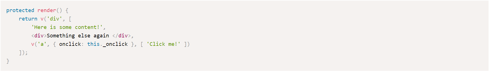

# dojo.io

[](https://travis-ci.org/dojo/site) [](https://codecov.io/gh/dojo/site)

Documentation website for [Dojo](https://github.com/dojo/framework).

- [Running dojo.io Locally](#running-dojoio-locally)
- [Build Time Renderer (BTR)](#build-time-renderer-btr)
- [Code Splitting](#code-splitting)
- [Content Pipeline](#content-pipeline)
	- [Markdown Compiler](#markdown-compiler)
	- [Available Widgets](#available-widgets)
		- [Alert](#alert)
		- [Aside](#aside)
		- [CodeBlock](#codeblock)
		- [CodeSandbox](#codesandbox)
	- [Adding New Widgets](#adding-new-widgets)
- [Adding Content](#adding-content)
	- [Blog Post](#blog-post)
	- [Tutorial](#tutorial)
	- [Reference Guide](#reference-guide)
	- [Roadmap Entry](#roadmap-entry)
- [Tests](#tests)
- [Now Deployments](#now-deployments)

## Running dojo.io Locally

Before building for the first time, run `npm install`.

To build, serve and watch, run `npm run build:dev`. Open http://localhost:9999/. The page will reload on any changes.

## Build Time Renderer (BTR)

[dojo.io](https://dojo.io) is built using the Build Time Renderer, part of the dojo build process, to statically render each route as html and css only. During the build process, after the site is built, each route is loaded up in JSDom, a snapshot is taken, and an index.html is generated. This allows pages to be loaded in full, quickly and **without javascript**.

No javascript is served to the user.

## Code Splitting

Each route should have its own unique `Outlet` in the `App.tsx` file and that `Outlet` should point to a unique widget for the route. If you are using the content pipeline to dynamically build your pages (aka you are using the `Section` or `Page` widgets) a wrapper widget may be required to accomplish this requirement (**example**: `TutorialsPage` and `TutorialsLanding`).

## Content Pipeline

In Dojo 5, a new feature was introduced to the Build Time Renderer called `Blocks`. `Blocks` allow us to run nodejs code during the BTR process, cache the results in the javascript output, and render them in the client. This forms the basis of the content pipeline.

The site's Blocks can be found under `src` subdirectories, labeled with a `.block.ts` extension.

### Markdown Compiler

The markdown compiler takes the contents of a mardown file as an input. The input is then run through `remark`, which converts it to HTML and looks for specially designated tags to convert to Dojo widgets. This is used for generating entire pages from markdown.

### Available Widgets

The available dojo widgets are defined in `src/common/markdown.ts` file as `handlers`.

#### Alert

The `Alert` renders a section of text with a colored left border. It takes an optional `type` parameters.

**Types**
- info (`default`)
- success
- warning
- danger

**Default sample**
```
[Alert]
Create a new root node for the application
[/Alert]
```


**Warning sample**
```
[Alert type=warning]
Create a new root node for the application
[/Alert]
```


#### Aside

The `Aside` widget takes a `title` parameter, and renders a card with a title and body text. The widget has a black background with an orange left border.

**Sample**

```
[Aside title="Mandatory object for properties"]
The 2nd argument of the `w()` function is mandatory even you have no properties to pass in. This is to ensure the correct type guarding for all widgets in TypeScript.
[/Aside]
```


#### CodeBlock

The `CodeBlock` widget takes two requires parameters (`path` and `language`) and one optional parameter (`region`).

- **path** - The path, relative to the `content` folder, of a file to parse.
- **language** - The language to use for code highlighting.
- **region** - (`Optional`) A defined region within the file to grab. If not provide, the entire file's contents will be returned.

**CodeBlock from file sample**

```
[CodeBlock path=tutorial-2-finished/src/App.tsx, language=tsx]
```


**CodeBlock from file with region**

```
[CodeBlock path=tutorial-2-finished/src/App.tsx, region=render, language=tsx]
```



**Designating a region**

Defining a region in a file varies by language. The region comments will never appear in a codeblock, as they are stripped out during the parsing.

- `ts`
	- **Start Region**: `// @start-region render`
	- **End Region**: `// @end-region render`
- `tsx`
	- **Start Region**: `// @start-region render`
	- **End Region**: `// @end-region render`
- `html`
	- **Start Region**: `<!-- @start-region render -->`
	- **End Region**: `<!-- @end-region render -->`
- `css`
	- **Start Region**: `/* @start-region render */`
	- **End Region**: `/* @end-region render */`
- `json`
	- **Start Region**: `// @start-region render`
	- **End Region**: `// @end-region render`

#### CodeSandbox

The `CodeSandbox` widget takes a `url` parameter, and renders an embedded codesandbox on the page using the provided URL.

**Sample**

```
[CodeSandbox url=https://codesandbox.io/embed/github/dojo/examples/tree/master/todo-mvc]
```


### Adding New Widgets

You can add any Dojo widget to the handlers list by following the steps below.

1. Add your widget to the `handlers` list in the `src/common/markdown.ts` file.
	- Simple widgets (no child content) can be designated as `inline` widgets. These must be written on one line in the markdown and don't need a closing tag.
		- **Example**: `{ type: 'CodeSandbox', inline: true }`
	- Widgets with child content should be multi-line widgets. These must be written on multiple lines with opening and closing tags on their own lines.
		- **Example**: `{ type: 'Aside' }`
2. Define your widget with its handle in the `src/main.tsx` file.
	1. Import your widget into the file.
	2. Define your widget in the registry: `registry.define('docs-alert', Alert);`
		- The handle to use is the lowercase version of the name you put in `handlers` with `docs-` added to the front.
3. (`Optional`) If your widget needs custom parsing logic (**example**: `CodeBlock`), you can add a widget creation function to the `widgets` list in the `src/common/markdown.ts` file. Use the handle you put in `main.tsx` to register your widget creation function.

## Adding Content

### Blog Post

1. Add a markdown file to the `content/blog/en` folder, in the following format.
	> content/blog/en/new-post.md
	```markdown
	---
	title: New Post
	date: 2019-03-22T12:00:00.000Z
	author: The Author
	---
	## New Post

	The description to show on the blog index page.

	
	<!-- more -->
	
	## Another header in the blog after the break
	
	More content for the blog after the break
	```

### Tutorial

Coming soon.

### Reference Guide

1. Reference Guides should be added to the repository of the referenced content (most likely `dojo/framework`). 
    
    The reference guide should consist of the following files:

	- `introduction.md`
	- `supplemental.md`

    These files should appear in `docs/:locale:/guide-name/` in the repository.

	Pages will be generated for the introduction and basic usage files, and one page for each top level header (`h1`) in the supplemental file.
2. Add the guide to the `GUIDES` list in the `src/constants.ts` file. Each guide has the following parameters:

    - **name** - Used in navigation
    - **directory** - (`Optional`) The name of the directory holding the guides. Defaults to `name.toLowerCase().replace(' ', '-')`
    - **repo** - (`Optional`) GitHub repository where the guide is located. Defaults to `dojo/framework`
    - **branch** - (`Optional`) Repository branch where the guide is located. Defaults to the latest framework branch.

### Roadmap Entry

Add a markdown file to the `content/roadmap/en` folder, in the following format.
> content/blog/en/new-post.md
```markdown
---
title: Dojo 6
date: Q2 2019
released: false
---

Features coming in Dojo X

- A feature
- A shiny feature
- A shinier feature
- The shiniest feature
```

#### Dates

Dates in the roadmap section can be of two formats:
1. Quarter format. **Example**: Q2 2019, **Parsed Value**: June 30, 2019 23:59 GMT
2. Month format. **Example**: January 2019, **Parsed Value**: January 31, 2019 23:59 GMT

The entries will be sorted by the parsed date. If the date cannot be parsed, it will be sorted to the top of the roadmap.

## Tests

We use Jest for unit tests on the site.

Run all unit tests, `npm run test` or `npm test` or `jest`.

## Now Deployments

On submission of a PR, an automatic deployment of the site is made to `now.sh`. The PR will be updated with the URL to the deployment automatically. You can test this deployment prior by running `now` locally (install the now cli with `npm install -g now`).

## Switching Versions

On a major version change, the following steps should be followed to archive the old site and update to the new version. All changes for the upcoming version can (and should) be merged into master ahead of time so they are deployed to `https://next.dojo.io/` for testing before the switch.

As part of this process you will be creating a new branch for the upcoming version. Master is always `next`, current should be in a versioned branch, like `v7`. For the sake of this example, `v7` will be the upcoming version and `v6` will be the previous "current" version.

| Version          | Version Number | Current Domain | New Domain After Update |
| ---------------- | -------------- | -------------- | ----------------------- |
| Current Version  | v6             | dojo.io        | v6.dojo.io              |
| Upcoming Version | v7             | next.dojo.io   | dojo.io                 |

1. Update the `deploy.sh` script to include the upcoming version's (`v7`) branch as a "production" branch. **NOTE: Do not create the branch yet.** (Example PR: [#220](https://github.com/dojo/site/pull/220))
    ```sh
    PROD_BRANCHES=("master" "v6" "v7")
    ```
2. In the Travis settings for `dojo/site`, add an `Environment Variable` for the current version (`v6`) branch.
   | Name | Value | Branch |
   | ---- | ----- | ------ |
   | DOMAIN_PREFIX | v6 | v6 |
3. In the current version's (`v6`) branch, update the footer links (Example PR: [#222](https://github.com/dojo/site/pull/222)):
    - Language links should be updated to include the new subdomain (in `Footer.tsx`)
    - Add a `Latest` link back to dojo.io
4. Update subdomains for the current version `v6`.
    1. After the #3 changes are merged, go to dojo project dashboard in now/vercel. Find the newly created projects for the current version (`v6`). In this case, two new projects were made `v6-dojo-io` and `zh-cn-v6-dojo-io`.
    2. In the settings for each, add the appropriate subdomains:
       | Project | Subdomain |
       | ------- | --------- |
       | `v6-dojo.io` | v6.dojo.io |
       | `zh-cn-v6-dojo-io` | zh-cn.v6.dojo.io |
5. Create the branch for the upcoming version (`v7`).
6. Update the target branches for documentation and examples (Example PR: [#221](https://github.com/dojo/site/pull/221))

After #6 is merged, the `v7` branch will now be the new current version and will deploy to `dojo.io`.
